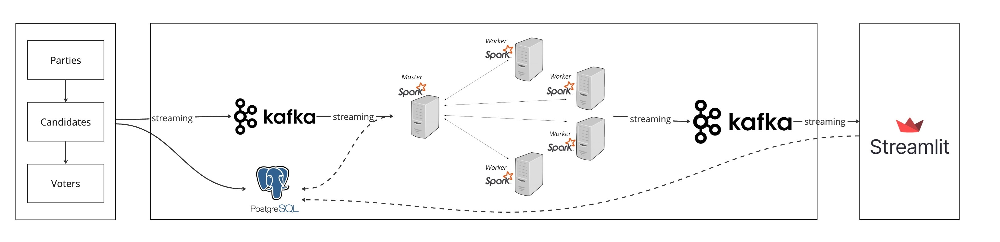

# Real-time Election Data Engineering System

A robust, distributed system for processing and visualizing election data in real-time using modern data engineering tools and practices.

## 🏗️ System Architecture


This project implements a comprehensive data pipeline that handles real-time election data processing through:
- Initial data ingestion and storage in PostgreSQL
- Stream processing with Apache Kafka and Spark
- Real-time visualization using Streamlit

## 🛠️ Technical Stack

### Data Storage & Streaming
- **PostgreSQL**: Primary database for storing voter, candidate, and party information
  - Handles structured data storage for entities
  - Maintains referential integrity between voters, candidates, and parties
  - Provides ACID compliance for transaction management

- **Apache Kafka**: Distributed event streaming platform for real-time data flow
  - Manages multiple topics for different data streams
  - Ensures fault tolerance through replication
  - Provides scalable message delivery

- **Apache Spark**: Distributed processing engine for real-time data analytics
  - Processes streaming data using micro-batch architecture
  - Performs real-time aggregations and analytics
  - Scales horizontally for increased load

### Frontend & Visualization
- **Streamlit**: Interactive dashboard for real-time election results
  - Provides real-time data visualization
  - Offers interactive filtering and exploration
  - Auto-refreshes to show latest results

### Infrastructure
- **Docker & Docker Compose**: Containerization and orchestration
  - Ensures consistent development and deployment environments
  - Simplifies service management and scaling
  - Facilitates easy setup and teardown

## 📊 Features
- Real-time vote processing and aggregation
- Live dashboard with vote counts and statistics
- Distributed processing for scalability
- Fault-tolerant data streaming
- Interactive data visualization
- Containerized deployment

## 🚀 Getting Started

### Prerequisites
- Docker and Docker Compose
- Python 3.9 or higher
- Java Development Kit (JDK) 8 or higher

### Installation

1. Clone the repository
```bash
git clone https://github.com/MOSSAWIII/realtime-voting-data-engineering.git
cd realtime-voting-data-engineering
```

2. Set up the environment
```bash
# Create and activate virtual environment
python -m venv .venv
source .venv/bin/activate  # On Windows: .venv\Scripts\activate

# Install dependencies
pip install -r requirements.txt
```

3. Start the services
```bash
# Launch required services
docker-compose up -d

# Run the components in separate terminals
python main.py        # Data initialization
python voting.py      # Vote generation
python spark-streaming.py  # Stream processing
streamlit run streamlit-app.py  # Dashboard
```

## 🏛️ System Components

### Data Model
- **Voters Table**:
  ```sql
  CREATE TABLE voters (
      voter_id VARCHAR(255) PRIMARY KEY,
      voter_name VARCHAR(255),
      date_of_birth VARCHAR(255),
      gender VARCHAR(255),
      nationality VARCHAR(255),
      registration_number VARCHAR(255),
      ...
  );
  ```

- **Candidates Table**:
  ```sql
  CREATE TABLE candidates (
      candidate_id VARCHAR(255) PRIMARY KEY,
      candidate_name VARCHAR(255),
      party_affiliation VARCHAR(255),
      biography TEXT,
      campaign_platform TEXT,
      photo_url TEXT
  );
  ```

- **Votes Table**:
  ```sql
  CREATE TABLE votes (
      voter_id VARCHAR(255) UNIQUE,
      candidate_id VARCHAR(255),
      voting_time TIMESTAMP,
      vote int DEFAULT 1,
      PRIMARY KEY (voter_id, candidate_id)
  );
  ```

### Stream Processing Pipeline
1. **Data Ingestion**:
   - Voter registration data → `voters_topic`
   - Candidate information → `candidates_topic`
   - Vote transactions → `votes_topic`

2. **Processing Layer**:
   - Real-time vote aggregation
   - Geographic distribution analysis
   - Party-wise vote counting
   - Turnout calculations

3. **Output Streams**:
   - Aggregated results → `aggregated_votes_per_candidate`
   - Location statistics → `aggregated_turnout_by_location`

### Visualization Features
- Real-time vote tallies per candidate
- Party-wise vote distribution
- Geographic heat maps of voter turnout
- Time-series analysis of voting patterns

## 🤝 Contributing
Contributions, issues, and feature requests are welcome! Feel free to check [issues page](https://github.com/MOSSAWIII/realtime-voting-data-engineering/issues).

## 👨‍💻 Author

**Mohamed Amine EL MOUSSAOUI**
- LinkedIn: [Mohamed Amine EL MOUSSAOUI](https://www.linkedin.com/in/medaminelmoussaoui/)
- GitHub: [@MOSSAWIII](https://github.com/MOSSAWIII)
- Email: [Contact me](mailto:your.email@example.com)

## 📝 License
This project is MIT licensed.